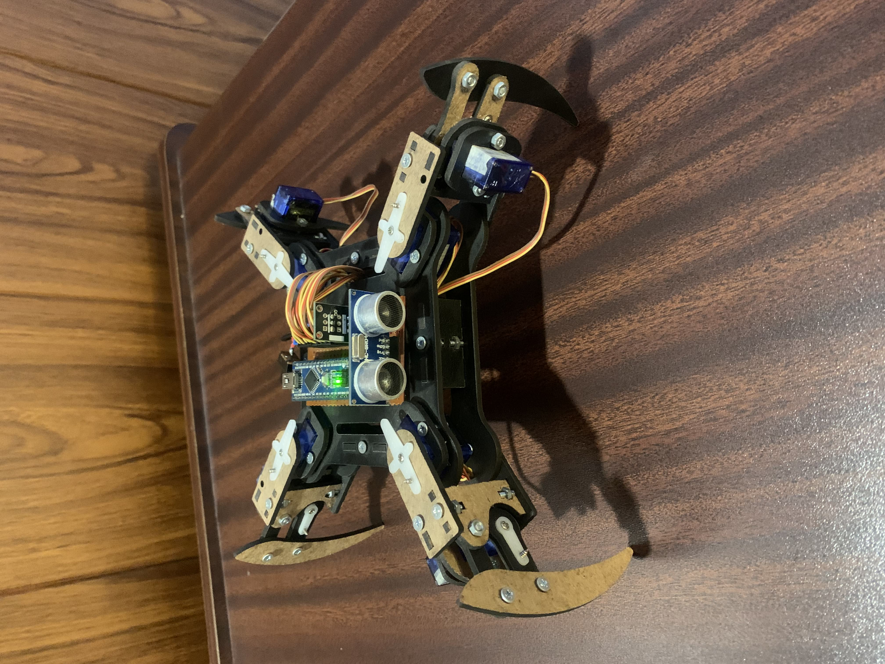
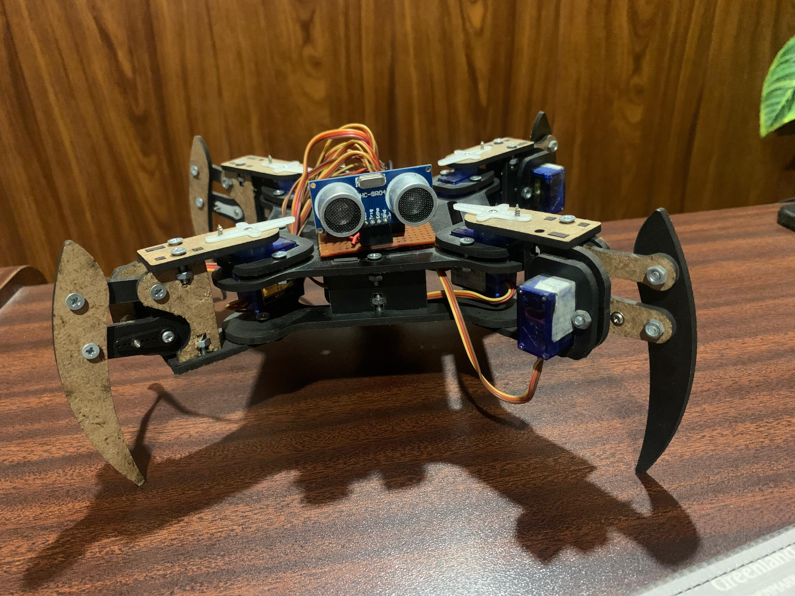
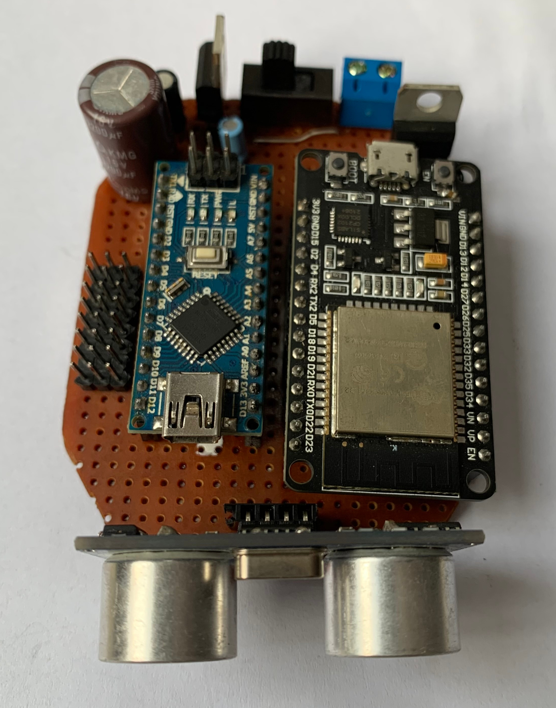

<div align = center>

# DIY Quadruped Robot
A lightweight, affordable quadruped robot powered by Arduino Nano and ESP32, featuring ultrasonic sensing capabilities. This project aims to provide an accessible entry point into robotics and programming through a DIY approach.<br/>
</div>

<div align="center">
  
</div>

## Features

- 8 DOF quadruped design (2 servos per leg)
- Wireless control through ESP32 wifi access point
- Obstacle detection using ultrasonic sensor
- Custom PCB design for component integration
- Arduino based control system
- Lightweight and modular construction

<br/>

## Videos

| Quadruped Robot Movement |
|-
| <div align="center"><a href="https://ahmadimran8177.github.io/quadruped_robot/assets/movements.mp4" target="_blank"></a></div><br/>

Click on the thumbnail to watch robot in action.

### Hardware Components

- 1× Arduino Nano
- 1× ESP32 development board
- 8× MG90 servo motors (or compatible)
- 1× HC-SR04 ultrasonic sensor
- Custom Circuit Board and electronic components
- Chassis components (laser-cut or 3D printed)
- M3 screws and nuts
- LiPo battery (7.4V recommended)

### 3. Wiring Guide

```
(Arduino) Microcontroller Connections:
- D2-D9 : Servo control signals
- A3    : Ultrasonic TRIG
- A2    : Ultrasonic ECHO
- TX    : Esp32 RX
- RX    : Esp32 TX
- GND   : Esp32 GND
```
## Circuit Board

| FrontSide | BackSide |
|-|-|
|  |  |

## Software Setup

1. Install Arduino IDE and required libraries
2. Upload provided code:
   - `main_controller.ino` to Arduino Nano
   - `remote_controller.ino` to ESP32

### Initial Configuration

```cpp
// WiFi credentials in esp32_wireless.ino
const char* ssid = "Custom_Wifi_Name";
const char* password = "Custom_Password";
```

## Usage

1. Power on the robot
2. Connect to the ESP32's WiFi network
3. Access control interface at `192.168.4.1`
4. Available commands:
   - Forward/Backward movement
   - Left/Right turns
   - Increase/Decrease Speed
   - Obstacle avoidance mode
   - Wave/Bow/Dance

## Troubleshooting

Common issues and solutions:

1. Erratic servo movement

   - Check power supply voltage
   - Verify servo connections
   - Calibrate servo positions in code

2. WiFi connection issues
   - Reset ESP32
   - Verify credentials
   - Check signal strength

## Contributing

1. Fork the repository
2. Create a feature branch
3. Submit a pull request

## License

This project is licensed under the MIT License - see LICENSE file for details.

## Acknowledgments

- Thanks to the Arduino and ESP32 communities
- Inspired by various open-source robotics projects and research papers (One of the research paper is present in assets dir)

## Project Status

Currently in active development. New features and improvements are welcome through pull requests.

## Contact

For questions or suggestions, please open an issue in the repository or message me from https://ahmadimran.com/contact
